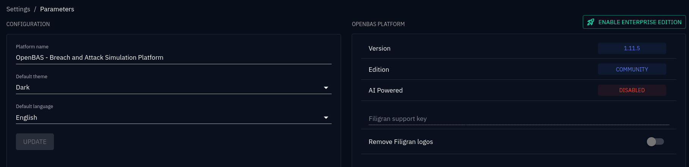
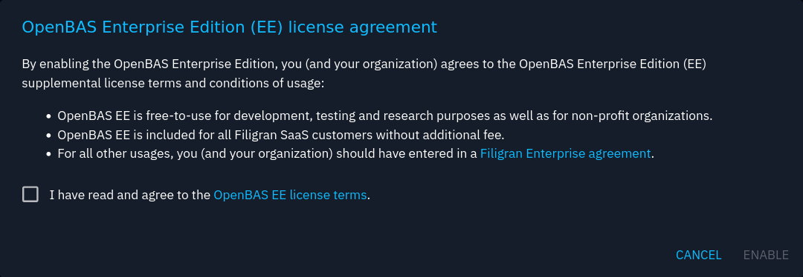

!!! tip "Filigran"

    [Filigran](https://filigran.io) is providing an [Enterprise Edition](https://filigran.io/offerings/openbas-enterprise-edition) of the platform, whether [on-premise](https://filigran.io/offerings/professional-support-packages) or in the [SaaS](https://filigran.io/offerings/software-as-a-service).

## What is OpenBAS EE?
OpenBAS Enterprise Edition is based on the open core concept. This means that the source code of OCTI EE remains open source and included in the main GitHub repository of the platform but is published under a specific license. As specified in the GitHub license file:

- The OpenBAS Community Edition is licensed under the Apache License, Version 2.0 (the “Apache License”).
- The OpenBAS Enterprise Edition is licensed under the OpenBAS Enterprise Edition License (the “Enterprise Edition Licensee”).

The source files in this repository have a header indicating which license they are under. If no such header is provided, this means that the file belongs to the Community Edition under the Apache License, Version 2.0.

## EE Activation
Enterprise edition is easy to activate. You need to go the platform settings and click on the Activate button.

Then you will need to agree to the Filigran EULA.

As a reminder:

- OpenBAS EE is free-to-use for development, testing and research purposes as well as for non-profit organizations.
- OpenBAS EE is included for all Filigran SaaS customers without additional fee.
- **For all other usages, OpenBAS EE is reserved to organizations that have signed a Filigran Enterprise agreement.**

## Available features

### Generative AI

Be able to use AI for content generation including emails, media pressure articles etc.

## More to come

More features will be available in OpenBAS in the future. Features like:

- Security posture automatic evalution.
- Premium mitigations and recommendation for configuration changes.
