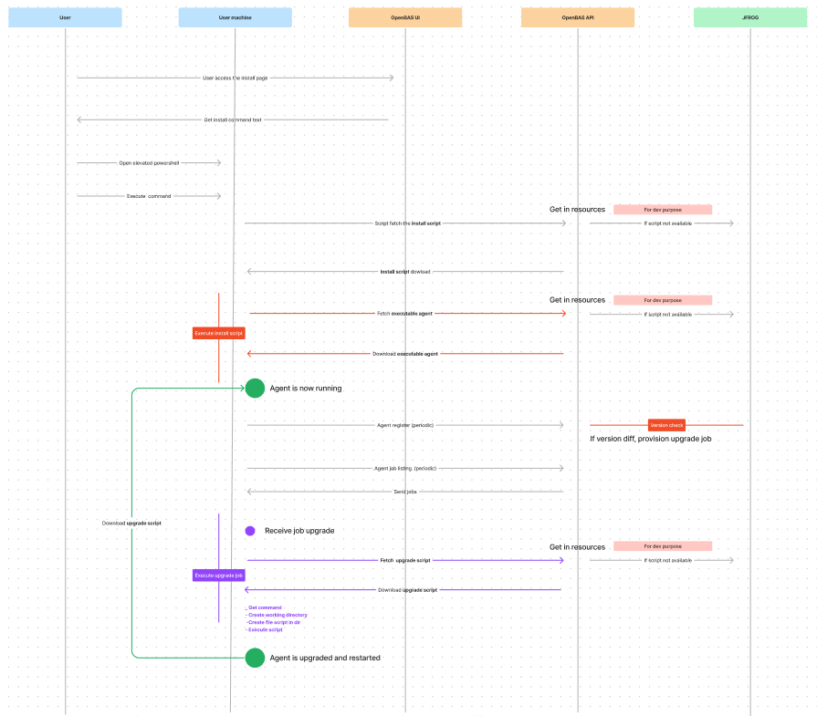
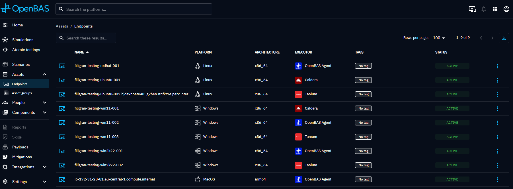

# OpenBAS Agent

## Introduction

The OpenBAS Agent is an application whose main role is to enroll an Asset on the OpenBAS platform,
to retrieve jobs or scripts to be executed and to transmit this information to Implants (subject to come)
for execution on the host Asset.

The Agent will not perform direct actions on the Asset to remain neutral for antivirus and ensure the full run of the simulation.

The OpenBAS Agent is compatible with different OS (Windows, Linux, macOS) and is developed in Rust.

## Installation

Depending on the OS, several installations are at your disposal :

Linux

  - Requirement → systemd, access to the openbas instance used
  - Compatibility → All systemd based linux distros
  - Installation → Create a service with name openbas-agent
  - Verification command line → `systemctl enable openbas-agent`
  - Start/Stop service →`systemctl start openbas-agent` & `systemctl stop openbas-agent`

MacOS

  - Requirement → launchd, access to the openbas instance used
  - Compatibility → All launchd based MacOS distros (10.4 Tiger or higher)
  - Installation → Create a service with name openbas-agent
  - Verification command line → `launchctl list | grep openbas.agent`
  - Start/Stop service → `launchctl bootstrap system ~/Library/LaunchDaemons/openbas-agent.plist` & `launchctl bootout system ~/Library/LaunchDaemons/openbas-agent.plist`

Windows

  - Requirement → powershell 7 or higher, admin user, access to the openbas instance used
  - Compatibility → All major Windows versions
  - Installation → Create a service with name openbas-agent and
  - Verification command line → `Get-Service -Name "OBASAgentService"`
  - Start/Stop service → `Start-Service -Name "OBASAgentService"` & `Stop-Service -Name "OBASAgentService"`

The following flow diagram represents the Agent installation flow :

## Network Traffic

The installation creates two firewall rules.

Inbound rule

Outbound rule

## Features

The main features of the OpenBAS Agent are:
- Agent registration on the OpenBAS platform

  The Agent is installed on the Asset using an agent-installer.exe file and runs as a service.
  It communicates with the deployed OpenBAS instance in order to enroll the Asset.

- Auto upgrade the Agent (on start-up and registration)

- Retrieval of jobs to be executed

  The Agent retrieves jobs to be executed from the OpenBAS instance every 30 seconds.
  For the moment, jobs are Implant to spawn and launch on the Asset, waiting to execute payloads of your Simulation's Injects.
  Each job execution logs is kept in a dedicated directory in order to have a trace of what happened (pid, executable).

- Deleting executables and execution directories

  The Agent deletes Implants that have been running for a predefined time and cleans the execution directories.

- Health check

  The Agent pings the OpenBAS instance every 2 minutes to notify it of its healthy status.

- Cleanup

  The Agent ensures that the processes it has executed are correctly finished or deleted if necessary. 
  The maximum time in minutes that a process associated with an execution directory can remain active is 20 minutes.

  The Agent removes execution directories to avoid excessive disk space. 
  The maximum time in minutes that an execution directory can be kept before being deleted is 2 days.
