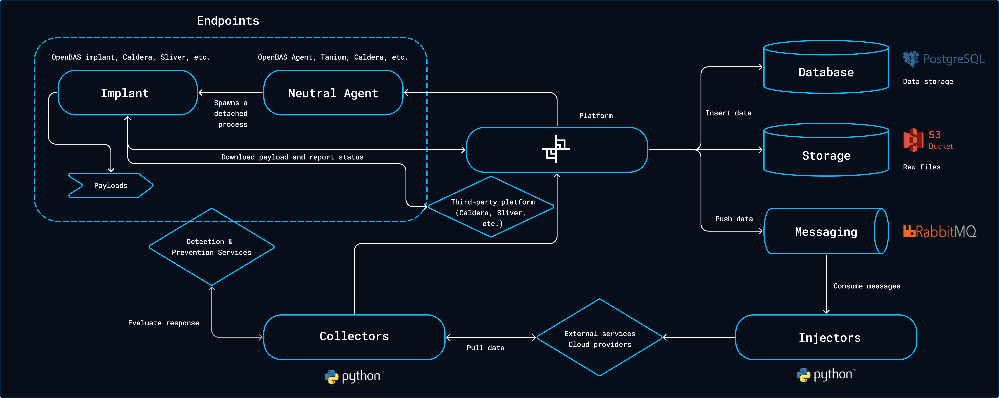
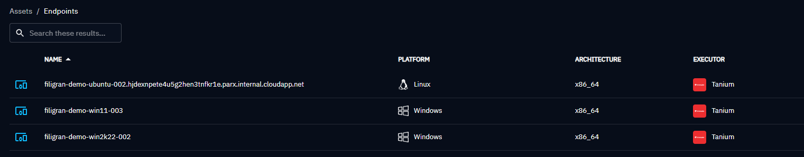
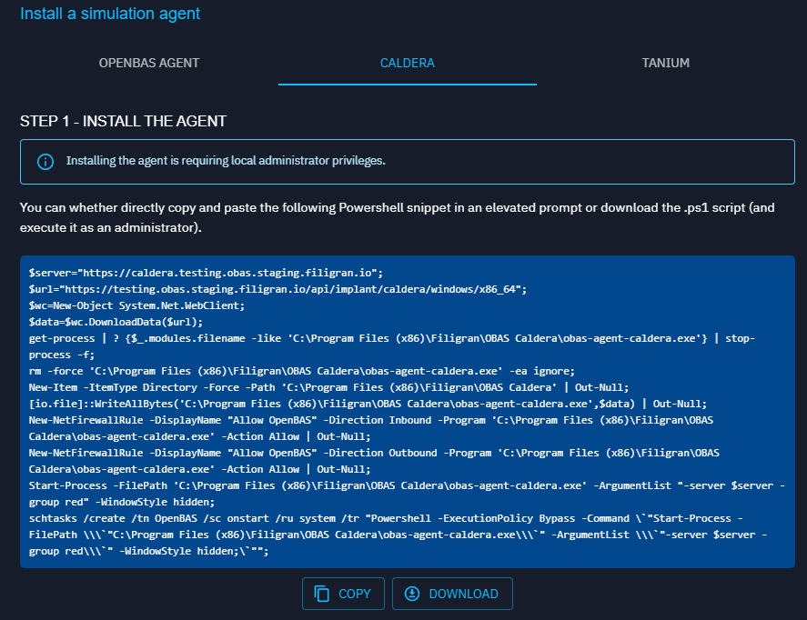

# Executors

## Introduction

To be able to use the power of the OpenBAS platform on endpoints, you need at least one **neutral executor** that will be in charge of executing implants as detached processes. Implants will then execute payloads.



## OpenBAS Agent

[More informations here](https://docs.openbas.io/latest/administration/openbas-agent)

## Tanium Agent

The Tanium agent can be leveraged to execute implants as detached processes that will the execute payloads according to the [OpenBAS architecture](https://docs.openbas.io/latest/deployment/overview).

### Configure the Tanium Platform

First of all, we are providing [2 Tanium packages](https://github.com/OpenBAS-Platform/openbas/blob/master/openbas-framework/src/main/java/io/openbas/executors/tanium/openbas-tanium-packages.json) to be imported in the Tanium platform.


!!! warning "Tanium package configuration"

    Because OpenBAS should run implants as detached processed, you must uncheck the box "Launch this package command in a process group" in the package configuration:

    

Once configured and imported, retrieve the package IDs from the URL `ui/console/packages/XXXXX/preview`.

### Configure the OpenBAS platform

To use the Tanium executor, just fill the following configuration.

| Parameter                          | Environment variable               | Default value | Description                                     |
|:-----------------------------------|:-----------------------------------|:--------------|:------------------------------------------------|
| executor.tanium.enable             | EXECUTOR_TANIUM_ENABLE             | `false`       | Enable the Tanium executor                      |
| executor.tanium.url                | EXECUTOR_TANIUM_URL                |               | Tanium URL                                      |
| executor.tanium.api-key            | EXECUTOR_TANIUM_API-KEY            |               | Tanium API key                                  |
| executor.tanium.computer-group-id  | EXECUTOR_TANIUM_COMPUTER_GROUP_ID  |               | Tanium Computer Group to be used in simulations |
| executor.tanium.windows-package-id | EXECUTOR_TANIUM_WINDOWS_PACKAGE_ID |               | ID of the OpenBAS Tanium Windows package        |
| executor.tanium.unix-package-id    | EXECUTOR_TANIUM_UNIX_PACKAGE_ID    |               | ID of the OpenBAS Tanium Unix package           |

!!! note "Tanium API Key"

    Please note that the Tanium API key should have the permissions to retrieve endpoint list from the Tanium GraphQL API as well as to launch packages on endpoints.

### Checks

Once enabled, you should see Tanium available in your `Install agents` section


Also, the assets in the selected computer groups should now be available in the endpoints section in OpenBAS:



NB : An Asset can only have one Tanium agent installed thanks to an unicity with hostname and IP parameters. 
If you try to install again a Tanium agent on a platform, it will overwrite the actual one and you will always 
see one endpoint on the OpenBAS endpoint page.

!!! success "Installation done"

    You are now ready to leverage your Tanium platform to run OpenBAS payloads!

## Caldera Agent

The Caldera agent can be leveraged to execute implants as detached processes that will the execute payloads according to the [OpenBAS architecture](https://docs.openbas.io/latest/deployment/overview/#architecture).

!!! note "Caldera already installed"

    If you already have a working Caldera installation, just go directly to [OpenBAS configuration section](#openbas-configuration).

### Deploy Caldera

To deploy Caldera, you can just add Caldera to the OpenBAS stack, we advise you to modify your `docker-compose.yml` and add a [Caldera service](https://github.com/OpenBAS-Platform/caldera/blob/filigran/docker/docker-compose.yml):

```
services:
  caldera:
    image: openbas/caldera-server:5.0.0
    restart: always
    ports:
      - "8888:8888"
    environment:
      CALDERA_URL: http://localhost:8888
    volumes:
      - type: bind
        source: caldera.yml
        target: /usr/src/app/conf/local.yml
```

As you can see in the configuration, you will also need a configuration file [caldera.yml](https://github.com/OpenBAS-Platform/caldera/blob/filigran/docker/caldera.yml) because Caldera does not support well environment variables for configuration.

Download [caldera.yml](https://github.com/OpenBAS-Platform/caldera/blob/filigran/docker/caldera.yml) and put it alongside your `docker-compose.yml` file. This file must be modified prior launching, only change what is marked as **Change this**, listed below.

```yaml
users:
  red:
    red: ChangeMe                                                                     # Change this
  blue:
    blue: ChangeMe                                                                    # Change this
api_key_red: ChangeMe                                                                 # Change this
api_key_blue: ChangeMe                                                                # Change this
api_key: ChangeMe                                                                     # Change this
crypt_salt: ChangeMe                                                                  # Change this
encryption_key: ChangeMe                                                              # Change this
app.contact.http: http://caldera.myopenbas.myorganization.com:8888                    # Change this
app.contact.tunnel.ssh.user_password: ChangeMe                                        # Change this
```

Just update your stack and check Caldera is running:

```bash
docker compose up -d
```

### OpenBAS configuration

Then, just change the OpenBAS configuration as follow:

| Parameter                   | Environment variable        | Default value | Description                                                                                  |
|:----------------------------|:----------------------------|:--------------|:---------------------------------------------------------------------------------------------|
| executor.caldera.enable     | EXECUTOR_CALDERA_ENABLE     | `false`       | Enable the Caldera executor           						                               |
| executor.caldera.url        | EXECUTOR_CALDERA_URL        |               | Caldera URL                           													   |
| executor.caldera.public-url | EXECUTOR_CALDERA_PUBLIC-URL |               | Caldera URL accessible from endpoints (ex: http://caldera.myopenbas.myorganization.com:8888) |
| executor.caldera.api-key    | EXECUTOR_CALDERA_API-KEY    |               | Caldera API key                                                                              |

### Agents

#### Deploy agents

Once enabled, you should see Caldera available in your `Install agents` section:


OpenBAS has built-in instruction if you want command line examples to deploy the agent on one endpoint.



!!! warning "Caldera AV detection"
    
    By default, the Caldera agent "Sandcat" is detected and blocked by antivirus. Here, we are using Caldera as a neutral executor that will execute implants that will execute payloads, so you need to add the proper AV exclusions as instructed in the OpenBAS screen.

    

#### Checks

All assets with a proper Caldera agent installed using the OpenBAS provided command line (then persistent) should now be available in the OpenBAS endpoints list.


NB : An Asset can only have one Caldera agent installed thanks to an unicity with hostname and IP parameters.
If you try to install again a Caldera agent on a platform, it will overwrite the actual one and you will always
see one endpoint on the OpenBAS endpoint page.
