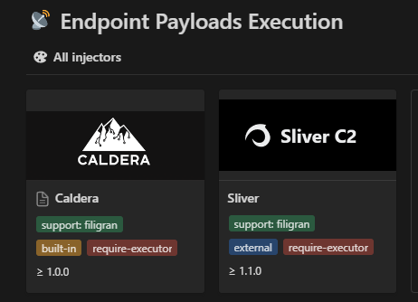

# Overview

Before starting the installation, let's discover how OpenBAS is working, which dependencies are needed and what are the minimal requirements to deploy it in production.

## Architecture

The OpenBAS platform relies on several external databases and services in order to work.

### Platform

The platform is the central part of the OpenBAS platform, allowing users to configure scenarios, simulations, atomic testings and all other components used in the context of breach and attack simulations and security validations.

### Neutral agents / executors

Executors are embedded into the platform but you should configure at least one. It is the system that will be used to execute local injectors on endpoints. Currently we support Caldera (default) and Tanium but multiple will be added in the near future including a home-made XTM agent (by Filigran). 

!!! warning "Required executor"

    Executors are responsible of executing endpoint payload injectors. To use them, you have to have at least one executor / neutral agent enabled. Injectors that require executors are marked in red in the [OpenBAS Ecosystem](https://filigran.notion.site/OpenBAS-Ecosystem-30d8eb73d7d04611843e758ddef8941b).
    

### Injectors

Injects are used to interact with third-party applications or services (including execution on the endpoints through executors) in the context of a simulation or an atomic testing. A few injectors are built-in but most of them are standalone Python processes. 

!!! note "List of injectors"

    You can find all currently available injectors in the [OpenBAS Ecosystem](https://filigran.notion.site/OpenBAS-Ecosystem-30d8eb73d7d04611843e758ddef8941b).

### Collectors

Collectors are used to connect to all security systems such as SIEMs, XDRs, EDRs, firewalls, mail gateways etc. to check if an inject (execution, emails, etc.) has been detected or prevented and fill the security posture. 

!!! note "List of collectors"

    You can find all currently available collectors in the [OpenBAS Ecosystem](https://filigran.notion.site/OpenBAS-Ecosystem-30d8eb73d7d04611843e758ddef8941b).

## Infrastructure requirements

### Dependencies

| Component                 | Version           | CPU       | RAM          | Disk type                    | Disk space         |
|:--------------------------|:------------------|:----------| :----------- | :--------------------------- |:-------------------|
| PostgreSQL                | ≥ 16.0            | 2 cores   | ≥ 8GB        | SSD                          | ≥ 16GB             |
| RabbitMQ                  | >= 3.11           | 1 core    | ≥ 512MB      | Standard                     | ≥ 2GB              |
| S3 / MinIO                | ≥ RELEASE.2023-02 | 1 core    | ≥ 128MB      | SSD                          | ≥ 16GB             |

### Platform

| Component    | CPU         | RAM          | Disk type                         | Disk space      |
|:-------------| :---------- | :----------- | :-------------------------------- | :-------------- |
| OpenBAS Core | 2 cores     | ≥ 8GB        | None (stateless)                  | -               |
| Injector(s)  | 1 core      | ≥ 128MB      | None (stateless)                  | -               |
| Collector(s) | 1 core      | ≥ 128MB      | None (stateless)                  | -               |