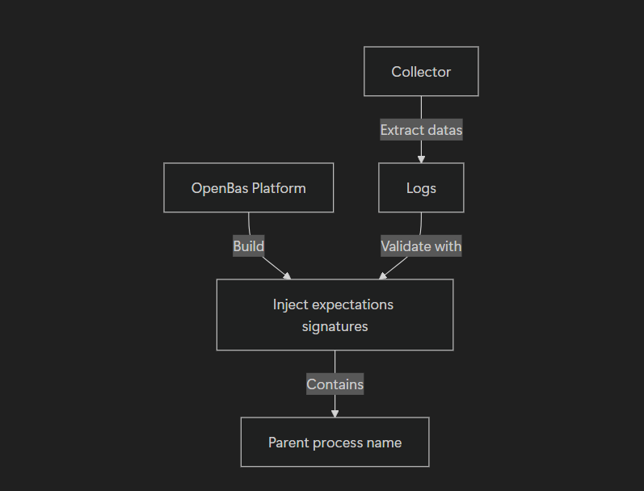

# Collector development

## Introduction

This guide explains how to implement an **OpenBAS collector for a EDR/XDR**, to retrieve security events and compare
them against injected expectations in OpenBAS.

## Implementing the Collector

The following documentation is based on the [CrowdStrike Collector](https://github.com/OpenBAS-Platform/collectors/tree/main/crowdstrike).

### 1. Retrieving Expectations

The first step involves fetching all expectations that have not yet been fulfilled by your collector. These expectations
must be validated within a short timeframe to assess the responsiveness of your EDR/XDR (default: 45 minutes). If this
period is exceeded, the expectations will be marked as failed.

### 2. Retrieving Alerts

This step focuses on collecting alerts from your service tiers. There are two key aspects to define:

- How to extract relevant information from an alert to match OpenBAS signatures.
- How to determine whether the alert successfully prevented or detected the attack based on the expectations.

Definition: a signature is a way to find an attack in an alert.

| Signature           | Description                                                                                                             |
|---------------------|-------------------------------------------------------------------------------------------------------------------------|
| PARENT_PROCESS_NAME | The parent process name of the attack, which corresponds to the implant name created with openbas-implant-INJECT_ID.exe |

### 3. Matching Expectations

The final step involves aligning retrieved expectations with logs and signatures from your service tiers to ensure
proper validation.

## Use it

Now, you can launch your collector by connecting it with OpenBAS.
Your collector will register to OpenBAS and you can view in Integrations > Collectors.

