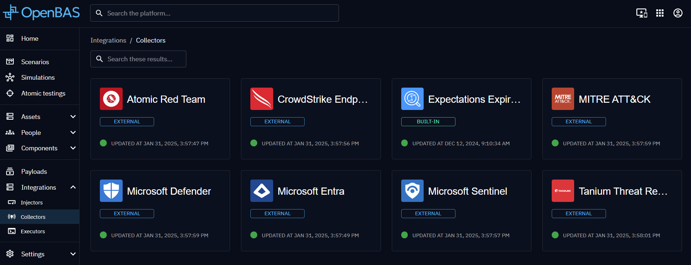

# Injector development

### Introduction

This guide explains how to implement an **OpenBAS injector**, to extend the platform's capabilities by adding new type
of injects.

### Implementing the Injector

The following documentation is based on
the [Http Injector](https://github.com/OpenBAS-Platform/injectors/tree/main/http-query).

#### 1. Define contract

The first step is to create a contract that will be accessible to the end user. When a user creates a new inject based
on your contract, they will fill in the fields defined within it. These fields serve as parameters used in your contract
logic to function properly.

#### 2. Define internal logic

The next step is to implement the internal logic based on your contract. When the inject runs, it will retrieve the
parameters provided by the end user and use them within your logic to perform the necessary actions.

### Use it

Now, you can launch your injector by connecting it with OpenBAS.
Your injector will register to OpenBAS and you can view in Integrations > Injectors.

