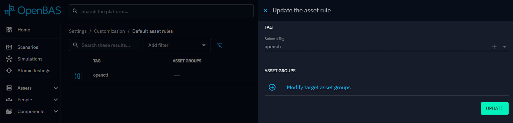

# Default Asset Rules 

Default Asset Rules let you define Asset Groups that are automatically applied to Injects based on a Scenario’s tags. Each Asset Rule consists of a Tag and list of Asset Groups

You can manage these rules in Settings → Customization.

When you create an Inject in a Scenario, if the Scenario has a tag matching one of the Asset Rules, the associated default Asset Groups are automatically applied to that Inject. When a Scenario is updated, if you add a tag matching one of the Asset Rules, a pop-up will appear asking if you want to apply those default Asset Groups to the existing Injects in the Scenario.

## OpenCTI default rule
By default, a rule for the **opencti** tag is created. This tag is automatically applied to Scenarios generated from OpenCTI (see [Generating Scenario from OpenCTI](../scenario/opencti_scenario.md) ). This default rule cannot be removed, and its tag cannot be modified.

