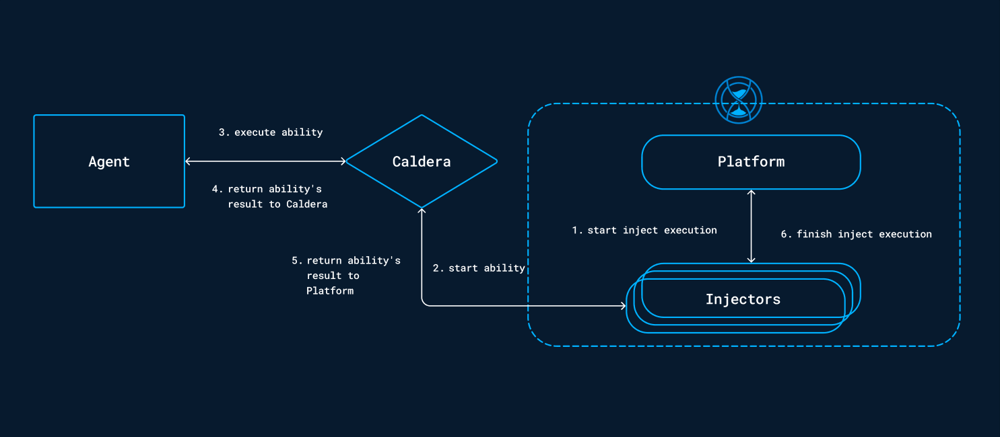

# Caldera injects

The integration between an OpenEx instance and a Caldera instance allows you to obtain a new library of injects. These
injects are based directly on the content of your Caldera and are played on the assets managed by its agents.

## Configuration variables

Below are the properties you'll need to set for OpenEx:

| Property                 | application.properties         | Docker environment variable      | Mandatory | Description                                              |
|--------------------------|--------------------------------|----------------------------------|-----------|----------------------------------------------------------|
| Enable Caldera collector | injector.caldera.enable        | `INJECTOR_CALDERA_ENABLE`        | Yes       | Enable the Caldera injector.                             |
| Injector ID              | injector.caldera.id            | `INJECTOR_CALDERA_ID`            | Yes       | The ID of the injector.                                  |
| Collector IDs            | injector.caldera.collector-ids | `INJECTOR_CALDERA_COLLECTOR_IDS` | Yes       | The collector IDs compatible with the injection process. |
| Caldera URL              | injector.caldera.url           | `INJECTOR_CALDERA_URL`           | Yes       | The URL of the Caldera instance.                         |
| Caldera API Key          | injector.caldera.api-key       | `INJECTOR_CALDERA_API-KEY`       | Yes       | The API Key for the rest API of the Caldera instance.    |

## Behavior

The list of available injects will be updated with all Caldera abilities found.
These new injects can be used by targeting an asset or a group of assets from the OpenEx platform.

The following async workflow will be carried out on the caldera injects :

