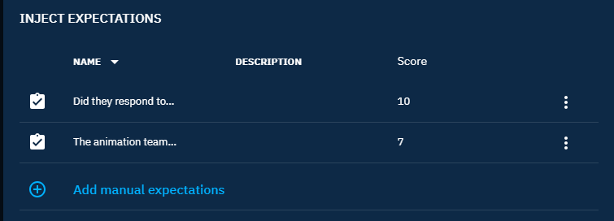
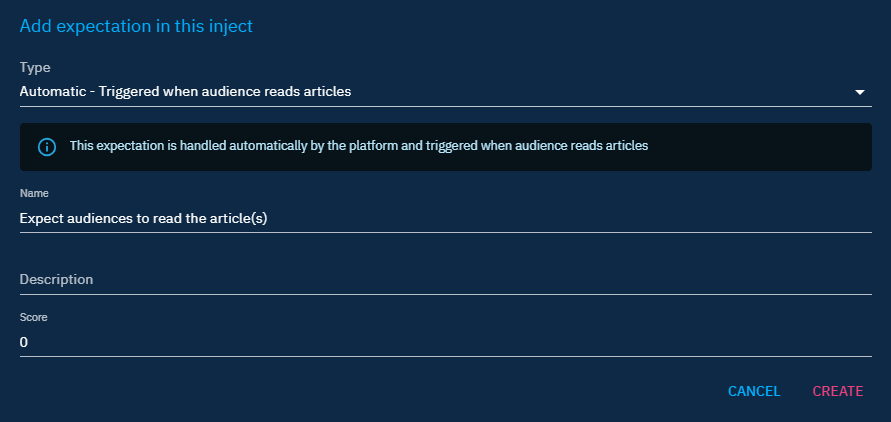
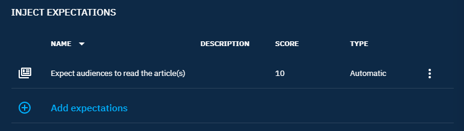
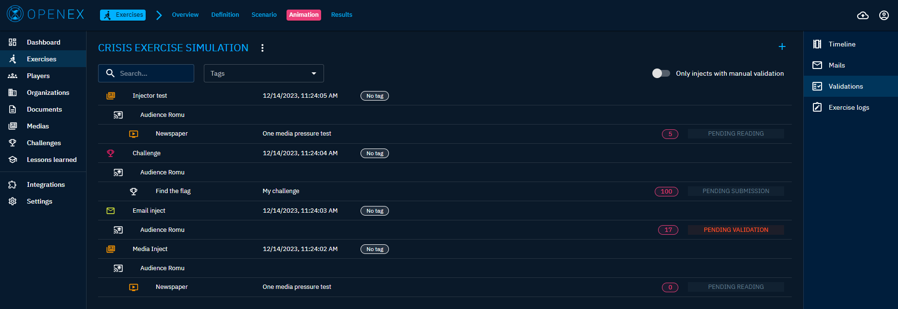

# Injects

## Types inject

An inject is a one-time event that is played as part of your exercise.

Several injects are available in the OpenBAS platform:

- Challenge: allows to publish challenges to be realized by players
- Email: allows to send emails to players
- HTTP request: allows executing HTTP requests (GET/POST/PUT) on external services
- Manual: allows to create a reminder for the animation team to carry out manually, outside the platform
- Mastodon: allows to publish a message on a mastodon account
- Media pressure: allows to publish an article on a predefined fake platform media
- SMS(OVH): allows to send text messages to players

### Manual inject

The manual inject is like a silent reminder. It allows you to place in the timeline a stimulus to be produced manually, outside the platform (for example simulated a call from a journalist on the switchboard telephone).

## HTTP inject

The HTTP inject is used to forge an HTTP request to a third party services in order to perform actions outside the platform (for example API call to an EDR).

## Expectations

Some injects can define expectations from players in order to define actions directly played by the players and those simulated by the animation team.

### Manual expectations

Email, SMS or Media Pressure type inject can have manual expectations. This allows to create expectations which will be validated once the inject has been executed.

### Media pressure expectation

This allows to create an expectation which will be validated once the audience concerned by the inject has read the article(s).

### Challenge expectation

An expectation is automatically created and it will be validated once the audience concerned by the inject has completed the challenge.

### Validation of expectations

These expectations can be viewed and validated, in the case of manual expectations, in a dedicated view.

