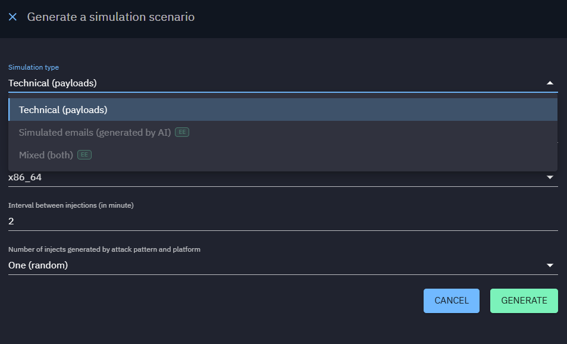
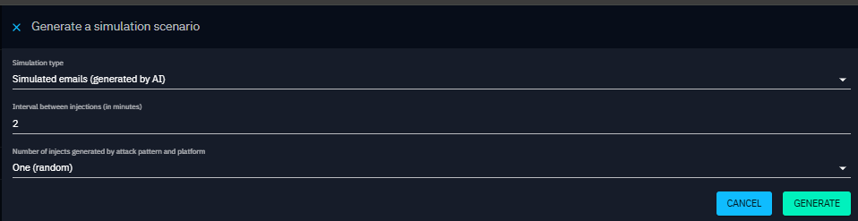
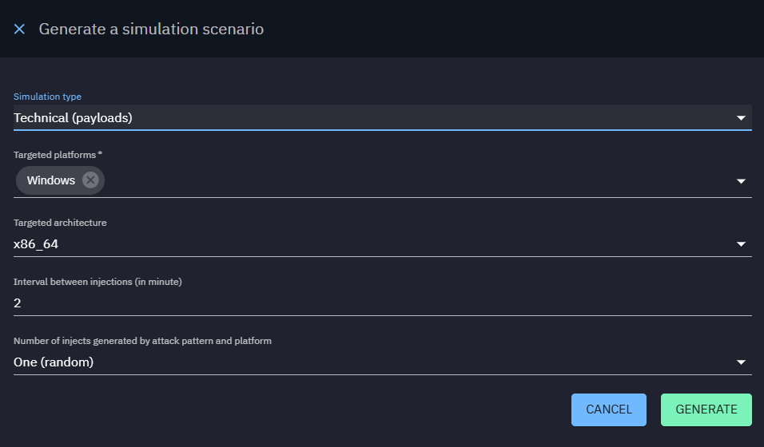
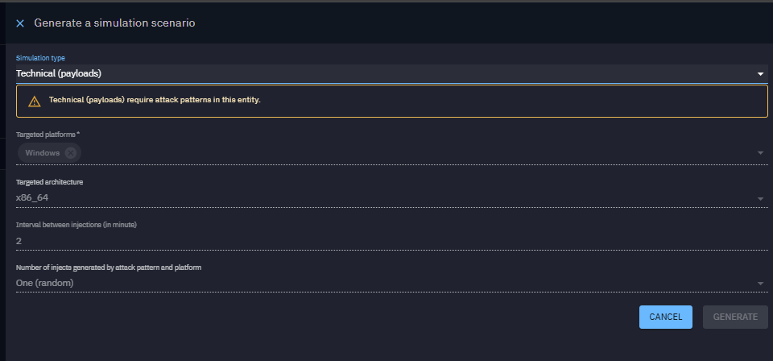
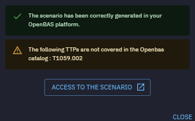

# Scenario generation from OpenCTI

Creating a [scenario](../scenario.md) can be a complex task, especially when aiming to build one that is meaningful and
relevant to the specific threats facing your organization. To streamline this process and ensure that scenarios are
closely aligned with your threat landscape, you can leverage the integration between OpenCTI and OpenBAS.

This integration works across multiple entities:

- Reports
- Grouping
- Incident Response
- Malware
- Campaigns
- Intrusion
- Request For Information
- Request For Takedown

When you click on the "Simulate" button, a form will appear with the following fields:

| Property                                                         | Description                                                   |
|------------------------------------------------------------------|---------------------------------------------------------------|
| Simulation type                                                  | Can be either "Technical" (payloads) or "Simulated" (emails)  |
| Interval between injection (in minutes)                          | The time between each injection execution                         |
| Number of injects generated by attack  pattern and platform  |                                                               |

If you choose the "Technical" (payloads) simulation type, you will also need to fill in the following fields:

| Property                                                         | Description                                                        |
|------------------------------------------------------------------|--------------------------------------------------------------------|
| Targeted platforms                                               | Supported platforms for executing the TTPs (Windows, Linux, macOS) |
| Targeted architecture                                            | Supported architectures for executing the TTPs (x86_64, arm64)     |

It’s essential to understand that a scenario creation for these entities relies on matching TTPs between OpenCTI and
OpenBAS. You’ll need to ensure that the TTPs in both platforms are aligned. For instance, if your report contains the
TTP T1059.001, a scenario can be created with an inject, provided OpenBAS also includes T1059.001.

If these TTPs are not supported by OpenBAS, you will receive an alert listing the uncovered TTPs.

When generating a scenario from OpenCTI, a scenario is created and can be accessed from the scenarios screen. The
scenario name will include a reference to OpenCTI, indicating its origin. This scenario will automatically contain
relevant sequences of injects based on the threat context identified in OpenCTI.

However, it's important to review and potentially customize the scenario to ensure it meets your organization's specific
requirements. Additionally, you'll need to select appropriate [targets](../targets.md) for the injects within the
scenario.

Once you've finalized the scenario, you can schedule your simulation as you would do for any other scenarios. The overall
results of the simulation will also be available directly within OpenCTI, providing insights into the threat context
upon which the scenario is based.

