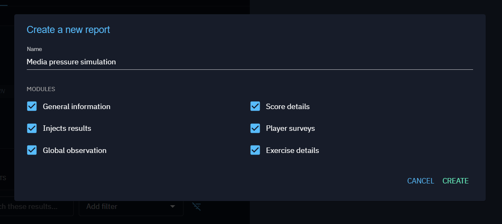

# Generating and Sharing Simulation Reports in PDF Format

You can generate and share a simulation report in PDF format. 
The following steps guide you through viewing, creating, and editing simulation reports, as well as generating PDF
of these reports.

## Viewing the List of Simulation Reports
* Access the Simulation Page
* Open the Report Drawer: Click on the "Edit" button located on the right side of the page, then select "Access Reports"

* A drawer will open, displaying the list of all previously generated reports for the selected simulation.
* Click on the report name from the list to view the full report details.

 

## Creating a New Simulation Reports
1. At the bottom of the report list in the drawer, click on the "Add" button to create a new report.

2. The default name of the report will be the same as the simulation name. You can edit the report name if needed.
3. You have the option to choose which modules to include in your report by selecting them.

## Adding Global Observations and Comments
When you navigate into the Report Simulation Details page:  
* You can add a global observation related to the overall simulation.
* You can add specific comments to each inject within the report.

All observations and comments are independent and unique to each report.

## Editing a Generated Report
Even after a report has been generated, it is still possible to update:   
* The report name.
* The modules to be displayed in the report.

## Generating a PDF of the Report
Once you are on the report page:  
Click on the "PDF" button on the top of the simulation report details page to generate a PDF format.

