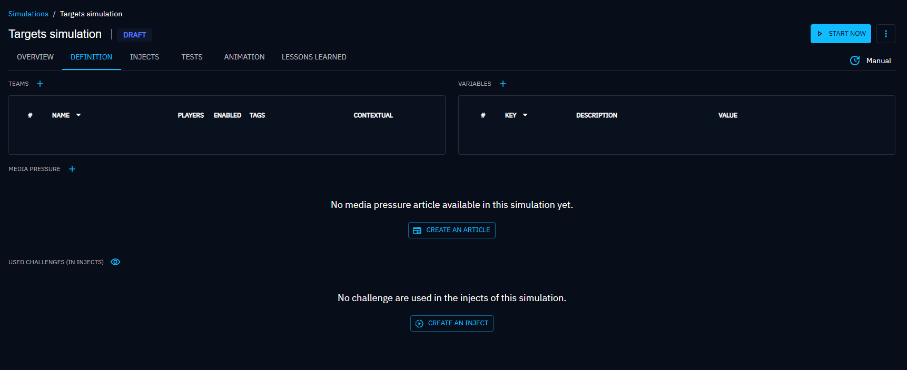
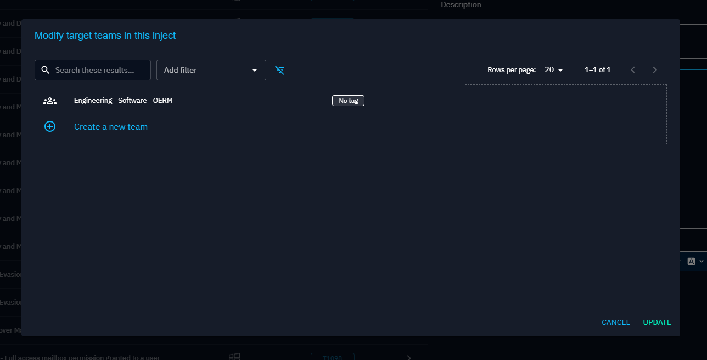

# Targets

When you are using an [Inject](injects.md), whether for [Atomic testing](atomic.md), [Scenario](scenario.md) or [Simulation](simulation.md), it's necessary to define the recipients, known as "targets", which could include [Players, Teams](teams_and_players_and_organizations.md), [Assets (endpoints) or/and Asset groups](assets.md) it will be sent to. They are called "targets" of the inject.

Note that certain injects can't target assets, while others can't target players. For instance, the "Send individual mails" inject can only target players and teams, not assets. 

Target selection is performed during inject creation or update.

<!-- screenshot of an inject contract -->

## Selecting Players and Teams

Directly targeting a player isn't yet possible. Instead, you must target a team. In scenarios or simulations, the team must be included in the scenario or simulation to be selectable. However, when creating atomic testing, all teams in the platform are selectable.

Note that visibility of teams and players is limited by the organization's [segregation](teams_and_players_and_organizations.md).

When selecting a team as the target, all players within that team will be targeted by the inject. Each player will have to complete expectations.

<!-- screenshot of an inject with selected teams -->

Here is the step by step guide to add a team as a target of a simulation/scenario.

Consider a simulation/scenario that was just created. Go to the **Definition** tab.

Click on **+** next to the **Teams** section, a dialog appears allowing the user to add a team.

The user then clicks on the team to enable the players.

Now the user can target the team when adding an inject in the simulation/scenario.

## Selecting Assets (endpoints) and Asset groups

You can target [assets (endpoints) directly or asset groups](assets.md). In the dedicated dialog, only assets compatible with the inject are listed by default.

When selecting an asset group to target, all assets (endpoints) within the group will be targeted by the inject. Each one will have to complete expectations.

<!-- screenshot with selected assets -->