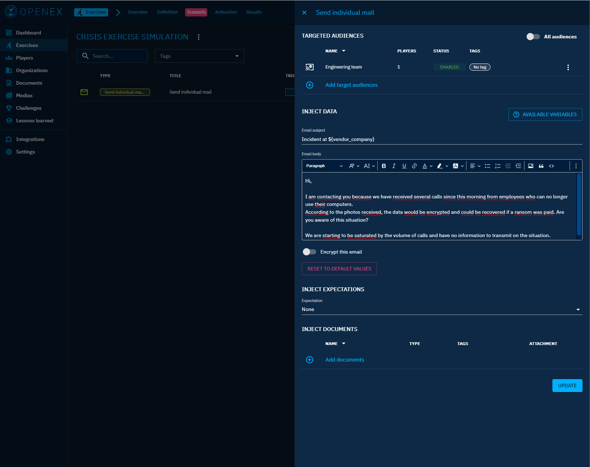

# Templates

## Built-In Variables

Within certain injects, users can leverage a set of predefined built-in variables to dynamically customize content.
These variables are designed to streamline the process of personalizing messages.
Examples of built-in variables include but not limited to :

- **${user.email}**: Represents the email of the target user
- **${exercise.name}**: Represents the name of the current exercise
- **${player_uri}**: Represents the player interface platform link

## Custom Variables

In addition to the built-in variables, users can define their own variables within an exercise.

To define custom variables :

1. Select an exercise
2. Navigate to the Definition tab
3. Navigate to the Variables section

In this section, users can create, update or delete custom variables.


### Limitation

To create custom variables, consider the following limitation:

- Only lowercase characters and ```_``` are authorized for the key value
- Variable value can only be string

## Use Variables

These variables can be used to enhance personalization of certain stimuli within an exercise.
Here is a non-exhaustive list of concerned stimuli :
- Email sending
- Sms sending


